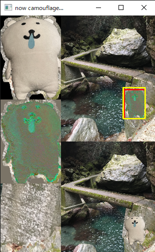
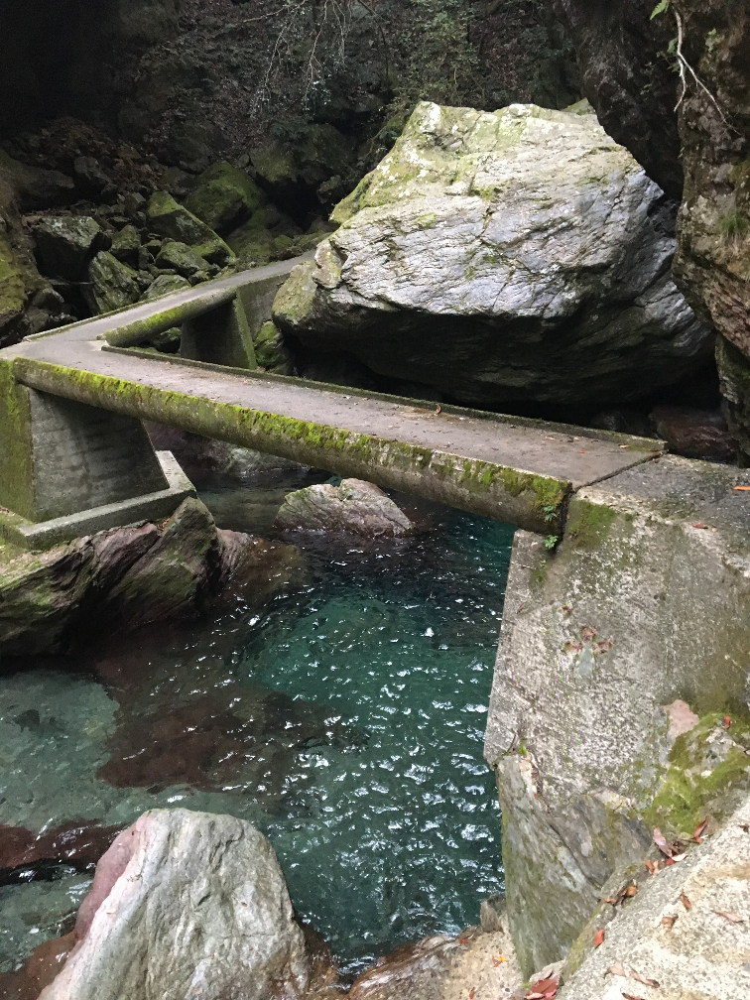

# Pytorch_CamouflageImages
Generate Camouflage Images by Pytorch


this implementation is mainly based on [Deep Camouflage Images](http://zhangqing-home.net/files/papers/2020/aaai2020.pdf) 

## Usage
### Setup Environment
In the case of conda.
```
conda create -n camouflage python=3.8
conda activate camouflage
```
and then, install pytorch / torchvision, reference [official website](https://pytorch.org/get-started/locally/)

finally, install dependent libraries
```
pip install -r requirements.txt
```

### Test
```python camouflage_HRNet.py --params <path to parameter python file>```

For quick test, you can generate camouflage images by ```python camouflage_HRNet.py --params params_Canyon```

Here is process window

|

### Dependencies
- PyTorch (>= 1.7)
- torchvision
- tqdm
- albumentations
- scikit-learn==0.23.2
- opencv-contrib

### Preparaion
For custom images, you should prepare 
- background image (ex. samples/inputs/cliff.jpg)
- foreground image (ex. samples/inputs/kuma.png)
- foreground image mask (ex.samples/inputs/kuma_mask/png)
    - the size of foreground image mask must be **same as that of foreground image** !
- .py file with parameters corresponding for your data (ex. params_Cliff.py)

## Parameters
**initial setting**
```
- input_path : path to foreground image
- mask_path : path to foreground image mask
- bg_path : path to background image
- output_dir : directory for generated images
- name : prefix name for generated image
- seed : pytorch seed
```

**mask setting**
```
- mask_scale : scale ratio for foreground image mask
- crop : crop foreground image mask to bounding box
- hidden_selected : If None, use hidden recommendation. If you wouldn't like to use hidden recommendation, you should give [y1_start,x1_start] for this parameter
```

**train setting**
```
- epoch : iteration for training
- lr : learning rate for adam
```

**loss setting**
```
- erode_border : If True, erode attention map
- style_weight_dic : dictionary of weights for style loss
- style_all : If True, use all background image for style loss. If False, use corresponding background image for style loss.
- alpha1 : scale parameter for leave loss
- alpha2 : scale parameter for remove loss
- mu : ratio of remove loss for camouflage loss
- lambda_weights : dictionary of weights for all loss
```

**log setting**
```
- show_every : interval for displaying intermediate result
- save_process : If True, save intermediate result by every `show_every`
- show_comp : compressino ratio for display
```

## Influence by loss function
According to [Deep Camouflage Images](http://zhangqing-home.net/files/papers/2020/aaai2020.pdf), losses has following impact for generated image:

- style loss : control similarity between generated image and background image
- camouflage loss : control diffuculty for detection of camouflage objects in generated image
    - leave loss : leave foreground features in generated image
    - remove loss : remove foreground features in generated image
- reguralization loss : control consistency for generated image
- total variation loss : smooth generated image

|style|style+cam|
|---|---|
|||

|style+cam+reg|style+cam+reg+tv|
|---|---|
|||

## Gallary

|SeaMountain|CliffRiver|
|---|---|
|||

|Mountain|Cliff|
|---|---|
|||
